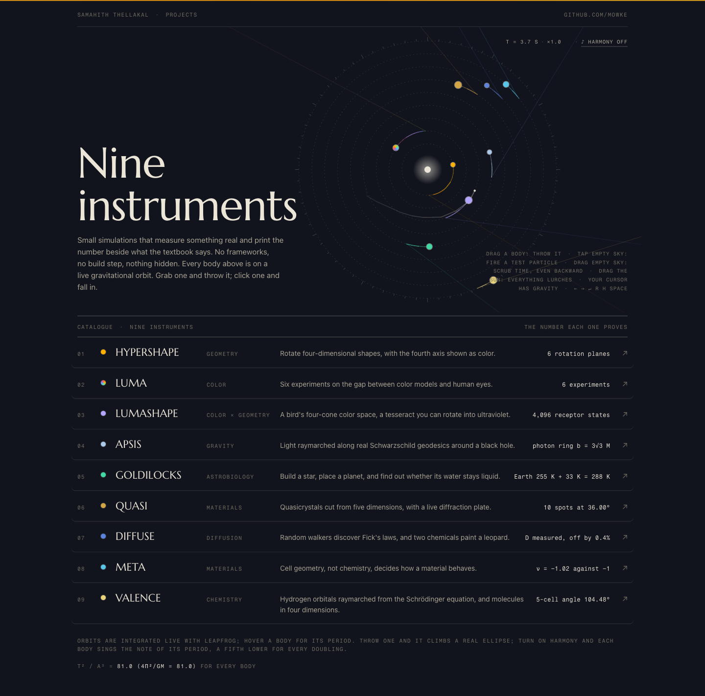
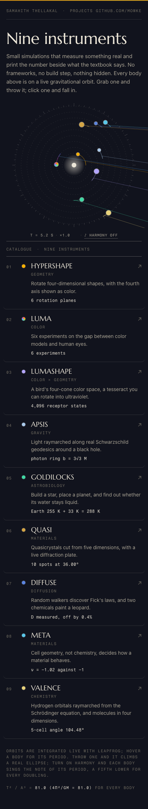

# mowke.github.io

**Live at [mowke.github.io](https://mowke.github.io/)**

The front door to nine browser instruments. These small simulations of geometry, light, matter, gravity and life measure something real and print the number beside what the textbook says.

The page is itself one of them. Every project is a body on a live gravitational orbit around the center, integrated with leapfrog each frame. Hover a body for its semi-major axis and period. Grab one and throw it and it climbs onto a real ellipse. The footer reports Kepler's third law, T² / a³, measured across all nine bodies against 4π² / GM. No frameworks, no build step.

## The instruments

| | project | field | the number it proves |
| --- | --- | --- | --- |
| 01 | [HYPERSHAPE](https://mowke.github.io/HYPERSHAPE/) | geometry | 6 rotation planes |
| 02 | [LUMA](https://mowke.github.io/LUMA/) | color | 6 experiments |
| 03 | [LUMASHAPE](https://mowke.github.io/LUMASHAPE/) | color × geometry | 4,096 receptor states |
| 04 | [APSIS](https://mowke.github.io/APSIS/) | gravity | photon ring b = 3√3 M |
| 05 | [GOLDILOCKS](https://mowke.github.io/GOLDILOCKS/) | astrobiology | Earth 255 K + 33 K = 288 K |
| 06 | [QUASI](https://mowke.github.io/QUASI/) | materials | 10 spots at 36.00° |
| 07 | [DIFFUSE](https://mowke.github.io/DIFFUSE/) | diffusion | D measured, off by 0.4% |
| 08 | [META](https://mowke.github.io/META/) | materials | ν = −1.02 against −1 |
| 09 | [VALENCE](https://mowke.github.io/VALENCE/) | chemistry | 5-cell angle 104.48° |

## Screenshots





## Running locally

```
python3 -m http.server 8104
```

Built by Samahith Thellakal.
